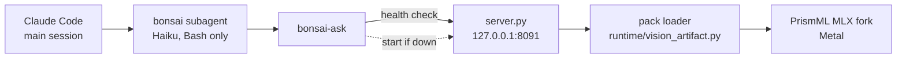

# bonsai-agent

A Claude Code subagent that runs tasks on a local [Bonsai 2 27B](https://huggingface.co/prism-ml/Ternary-Bonsai-2-27B-mlx-2bit) model. The model runs on Apple Silicon through the [PrismML MLX fork](https://github.com/PrismML-Eng/mlx). The server starts itself on the first request and exits when idle.

PrismML ships no MLX server for Bonsai 2. `mlx_lm.server` and `mlx_vlm.server` load the pack without its Hadamard transform and return wrong output with no error. `server.py` loads the model through the loader bundled in the pack instead.

## Quick start

Requires Apple Silicon, macOS with Xcode and its Metal Toolchain, [`uv`](https://docs.astral.sh/uv/), and about 12 GB of disk.

```bash
git clone https://github.com/michael-denyer/bonsai-agent.git
```

```bash
./bonsai-agent/install.sh
```

```bash
bonsai-ask --no-think "What is 17 * 23? Reply with the number only."
```

In Claude Code, ask for the `bonsai` agent by name, or say "use the local model".

## How it works



`bonsai-ask` decides what to do from two facts, the health endpoint and the pidfile.

| Health | Pidfile process | Action |
|---|---|---|
| ok | any | Use the running server. |
| down | alive | Wait. Another caller is starting it. |
| down | dead or missing | Remove the stale pidfile, start the server, wait. |

An exclusive lock on the start path means concurrent callers produce one server. If the server dies while starting, `bonsai-ask` exits nonzero and prints the tail of the server log.

## Usage

```
bonsai-ask [--no-think] [--effort {xhigh,medium,low}] [--max-tokens N] [--system TEXT] [PROMPT]
bonsai-ask --status
bonsai-ask --stop
```

The prompt comes from stdin when no positional argument is given. Only the answer goes to stdout. The model's thinking is dropped from the output.

| Variable | Default | Purpose |
|---|---|---|
| `BONSAI_HOME` | `~/.local/share/bonsai` | Venv, model, MLX source, logs, pidfile. |
| `BONSAI_PORT` | `8091` | Server port on `127.0.0.1`. |

The server also answers `POST /v1/chat/completions` in the OpenAI shape, without streaming, and `GET /health`.

## The MLX build

`install.sh` builds MLX from the fork's `v0.31.2_prism` branch with two cherry-picks.

- Fork commit `4446b4e6` turns off the NAX path on M5-class GPUs, where it computes wrong results.
- Upstream [ml-explore/mlx#3963](https://github.com/ml-explore/mlx/pull/3963) makes the Metal kernels compile under Xcode 27 (Metal 4.1). [PrismML-Eng/mlx#13](https://github.com/PrismML-Eng/mlx/pull/13) proposes the same fix for the fork.

The fork's `prism` branch is not used. It predates `mx.new_thread_local_stream`, which `mlx-lm 0.31.3` needs.

`requirements.txt` moves the pack's `transformers==5.5.0` pin to `5.17.0` because of GHSA-xrqw-3rrv-vx5w.

## Structure

- `agents/bonsai.md` is the subagent definition, linked into `~/.claude/agents/`.
- `bonsai-ask` is the client and launcher. Python standard library only.
- `server.py` is the model server. It runs in the venv.
- `install.sh` builds the runtime, downloads the model, and links the two entry points.

## Limits

Text only. One generation at a time, because this MLX build crashes when generation moves between threads, so one worker thread owns the model.

Measured on an M5 Pro with 64 GB on 2026-09-18, sustained decode runs at about 22 tokens per second (300 tokens, one run) and the model holds about 9 GB of memory while loaded. With the weights in the page cache, a cold start adds about 2 seconds.
